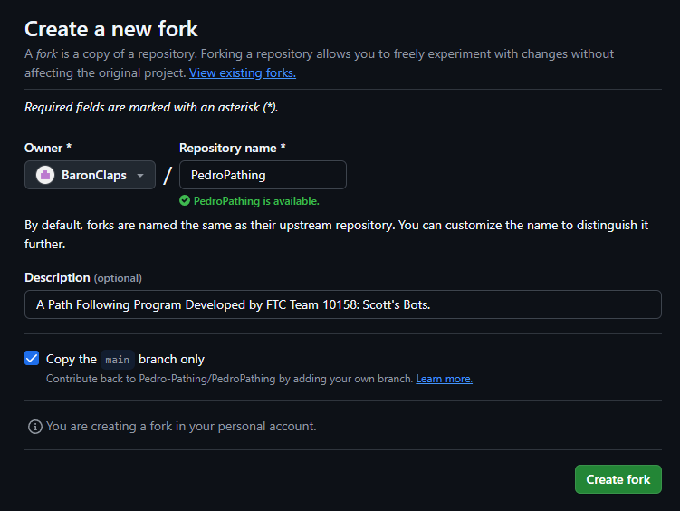
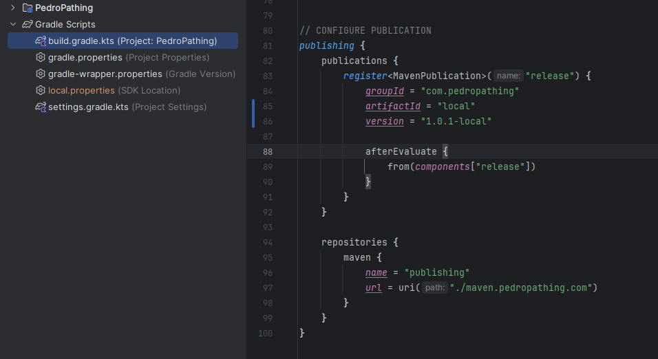
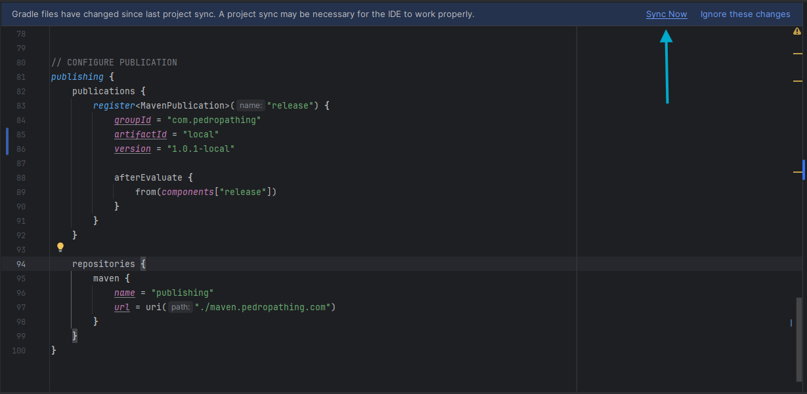
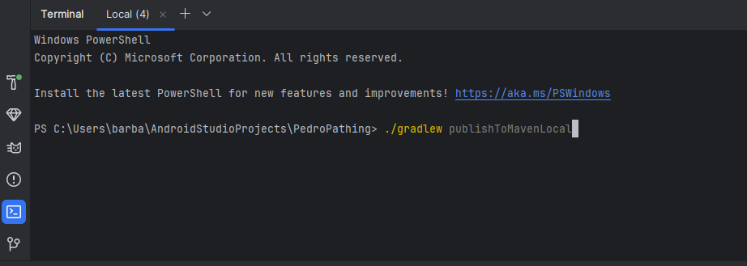
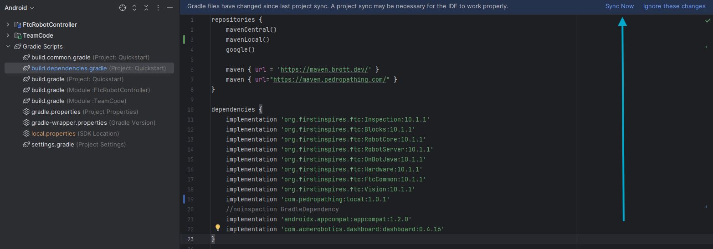

# Making Local Changes to the Library

This page is for documenting changes you make to the library that are not in the main repository.  

## Steps to Make Local Changes to the Library:
#### 1. To begin, fork the Pedro Pathing repository: https://github.com/Pedro-Pathing/PedroPathing/fork.

#### 2. Make your changes to the library. (Lets say I create a new class)  

#### 3. Open `build.gradle.kts` and navigate to the `publishing` block. Change the `artifactId` to `local` and the `version` to `x.x.x-local`, where `x.x.x` is the version of the library you want to set it as.  

#### 4. Then Sync Gradle  

#### 5. Then, open terminal and run `./gradlew publishToMavenLocal`  

#### 6. Once it says Build Successful, you can now use open your main project/quickstart. 

#### 7. Open `build.dependencies.gradle` and navigate to the `repositories` block. Add `mavenLocal()` to the block.
#### 8. Then, navigate to the `dependencies` block and add `implementation 'com.pedropathing:local:x.x.x-local'` where `x.x.x` is the version you set in the library.
 
#### 9. Sync Gradle and you should now be able to use your quickstart/project with your library changes.

### Remember, these changes are local only, so make sure to have any users of your library to follow these steps to use your changes.